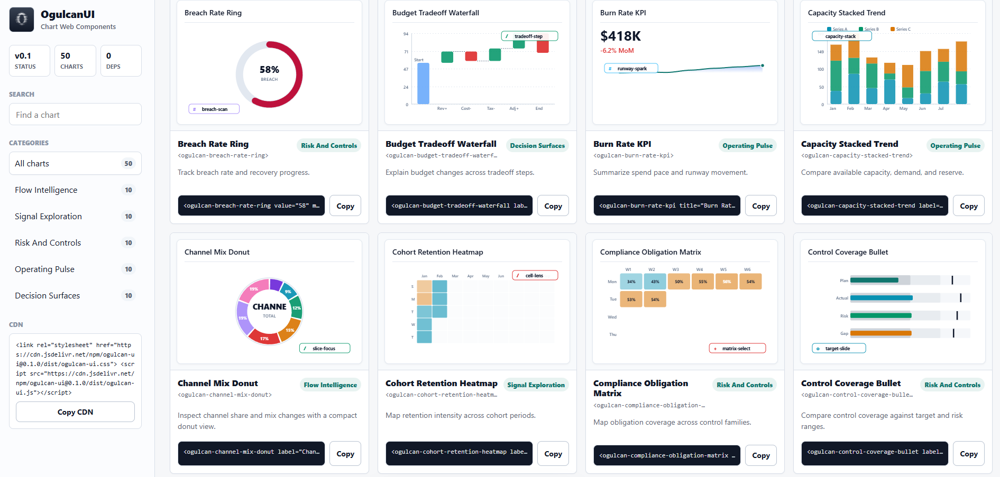
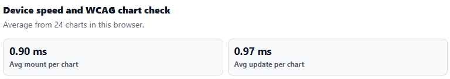

# OgulcanUI

**Fastest-first, zero-dependency chart Web Components for enterprise dashboards.**

[](https://www.npmjs.com/package/ogulcan-ui)

OgulcanUI v0.1.0 ships **50 vanilla Web Component charts** in one browser file. It is built for teams that need dashboard charts to mount quickly, update quickly, stay small, and work without React, Svelte, Vue, Chart.js, D3, hydration, build tooling, or runtime dependencies.



## The Speed Story

OgulcanUI is designed around the part users feel first: **how fast charts appear and update on real devices**. The demo includes a browser-side speed panel so every team can measure mount and update time on the exact laptop, phone, browser, kiosk, or embedded environment they care about.



| Speed signal | Current proof |
|--------------|---------------|
| Average mount | Screenshot run: **0.90 ms per chart** |
| Average update | Screenshot run: **0.97 ms per chart** |
| Load gate | `bun run verify:load` passes all 50 charts |
| Runtime model | One JS file, static SVG, Shadow DOM, no framework runtime |
| Update model | Redraw fingerprinting skips unchanged charts |
| Data safety | Capped parsing, capped series length, oversized attributes rejected or downsampled |

The screenshot is from one local browser run and will vary by device. That is intentional: OgulcanUI exposes the benchmark in the demo so users can verify speed in their own environment instead of trusting a synthetic marketing number.

## Why Teams Choose OgulcanUI

| Requirement | OgulcanUI v0.1.0 |
|-------------|------------------|
| Fast dashboards | Browser-native custom elements with no virtual DOM or external chart engine |
| Simple delivery | One CDN script or one hosted repository artifact |
| Small transfer | `ogulcan/ogulcan.js`: 668.7 KB raw, 35.3 KB gzip |
| Tiny CSS | `ogulcan/ogulcan.css`: 12.1 KB raw, 3.2 KB gzip |
| Chart coverage | 50 ready-made charts across operations, risk, finance, product, and strategy |
| Accessibility checks | 50/50 charts pass automated chart text-alternative checks |
| Framework fit | Plain HTML, React, Svelte, Vue, Astro, Rails, Laravel, Django |
| License | MIT |

OgulcanUI is not a code-copy starter kit. It is a chart runtime you consume as a browser file.

## Quick Start: npm

Install the package from npm:

```bash
npm install ogulcan-ui
```

[View `ogulcan-ui` on npm](https://www.npmjs.com/package/ogulcan-ui)

## Quick Start: CDN

```html
<link rel="stylesheet" href="https://cdn.jsdelivr.net/npm/ogulcan-ui@0.1.0/dist/ogulcan-ui.css">
<script src="https://cdn.jsdelivr.net/npm/ogulcan-ui@0.1.0/dist/ogulcan-ui.js"></script>

<ogulcan-market-pulse-line
  label="Market pulse"
  color="#2563eb"
  data="42,48,46,58,63,70,76">
</ogulcan-market-pulse-line>
```

## Quick Start: Repository File

Download these files from this repository and serve them from your site:

```text
ogulcan/ogulcan.js
ogulcan/ogulcan.css
```

Then use them like this:

```html
<link rel="stylesheet" href="/assets/ogulcan.css">
<script src="/assets/ogulcan.js"></script>

<ogulcan-risk-appetite-gauge
  label="Risk appetite"
  value="68"
  min="0"
  max="100"
  color="#b45309">
</ogulcan-risk-appetite-gauge>
```

`ogulcan.js` contains all 50 charts. You do not need to copy `src/components/*`, `scripts/*`, or generator files into your product.

## Performance Architecture

OgulcanUI stays fast by keeping the runtime boring in the best possible way:

- No framework runtime
- No virtual DOM
- No external chart engine
- No fetch after the file loads
- No canvas dependency
- Static SVG rendered inside Shadow DOM
- Data parsing capped at 128 points per series
- Oversized attributes rejected or downsampled
- Redraw skipped when the chart fingerprint is unchanged
- ResizeObserver updates batched with `requestAnimationFrame`

Current verified load result:

```text
bun run verify:load
Passed: 50
Failed: 0
```

## Accessibility

Every chart exposes a lightweight screen-reader summary:

- The chart host uses `role="img"`.
- Decorative SVG drawing is hidden from assistive technology.
- A hidden `.chart-a11y-summary` text alternative is generated per chart.
- Automated browser audits cover all 50 charts.

Current verified accessibility result:

```text
bun run verify:a11y
Passed: 50
Failed: 0
```

This is automated WCAG-oriented coverage for chart text alternatives and component semantics. Product teams still need to test complete pages for their own color contrast, headings, navigation, keyboard flows, and content.

## Use With React, Svelte, Or Plain HTML

OgulcanUI charts are custom elements. Framework wrappers are optional.

Plain HTML:

```html
<ogulcan-uptime-kpi-spark
  title="Uptime"
  value="99.98%"
  change="+0.03%"
  trend="up"
  sparkline="97,98,98,99,100"
  color="#0f766e">
</ogulcan-uptime-kpi-spark>
```

React:

```jsx
export function DashboardChart() {
  return (
    <ogulcan-market-pulse-line
      label="Market pulse"
      color="#2563eb"
      data="42,48,46,58,63,70,76"
    />
  );
}
```

Svelte:

```svelte
<ogulcan-market-pulse-line
  label="Market pulse"
  color="#2563eb"
  data="42,48,46,58,63,70,76" />
```

## Chart API

Most charts:

```html
<ogulcan-revenue-stream-treemap
  label="Revenue"
  color="#0f766e"
  data="32,24,18,14,12">
</ogulcan-revenue-stream-treemap>
```

Gauge and ring charts:

```html
<ogulcan-threshold-ring
  label="Threshold"
  value="74"
  min="0"
  max="100"
  color="#be123c">
</ogulcan-threshold-ring>
```

KPI spark charts:

```html
<ogulcan-burn-rate-kpi
  title="Burn rate"
  value="$418K"
  change="-6.2% MoM"
  trend="down"
  sparkline="72,74,73,78,82,85,88"
  color="#1d4ed8">
</ogulcan-burn-rate-kpi>
```

Data can be a comma-separated numeric list or a JSON array. For runtime changes, update attributes:

```js
const chart = document.querySelector("ogulcan-market-pulse-line");
chart.setAttribute("data", "45,49,53,61,66,72");
```

## Chart Catalog

| Category | Charts |
|----------|--------|
| Flow Intelligence | CustomerJourneySankey, RevenueStreamTreemap, ChannelMixDonut, ConversionPathFunnel, SupplyChainGantt, DependencyRadar, AllocationWaterfall, SegmentBridgePareto, ProductAdoptionStack, WorkflowStepArea |
| Signal Exploration | DemandForecastProjection, AnomalyBandControl, CohortRetentionHeatmap, MarketPulseLine, SensorDriftScatter, QualityHistogram, ScenarioSensitivityMultiLine, VolatilityBoxplot, GrowthCurveArea, ThresholdRing |
| Risk And Controls | ComplianceObligationMatrix, IncidentSeverityPareto, AccessPostureRadar, RiskAppetiteGauge, AuditFindingWaterfall, ControlCoverageBullet, FraudPatternScatter, PolicyExceptionHeatmap, ExposureLimitBars, BreachRateRing |
| Operating Pulse | UptimeKpiSpark, QueueDepthBars, LatencyControlChart, CapacityStackedTrend, ReleaseTrainGantt, ServiceHealthMatrix, ErrorBudgetLine, ThroughputHistogram, WorkforceUtilizationHBars, BurnRateKpi |
| Decision Surfaces | PriceElasticityScatter, PortfolioOptimizationRadar, BudgetTradeoffWaterfall, PrioritizationTreemap, StrategyFunnel, ForecastConfidenceBoxplot, OpportunityPareto, InvestmentMixDonut, PlanVsActualBullet, ScenarioOutcomeProjection |

Tag names are `ogulcan-` plus the kebab-case chart name. Example: `MarketPulseLine` becomes `<ogulcan-market-pulse-line>`.

## Local Demo

```bash
bun install
bun run build
bun run start
```

Open:

```text
http://localhost:3000/demo.html
```

The demo is a searchable live chart catalog with copyable snippets and a browser-side speed/WCAG panel.

## Development

Install:

```bash
bun install
```

Build all distributable files:

```bash
bun run build
```

Run core verification:

```bash
bun run verify:a11y
bun run verify:load
bun run test:playwright:structural
```

Important source locations:

| Path | Purpose |
|------|---------|
| `ogulcan/ogulcan.js` | Downloadable all-chart browser file for users |
| `ogulcan/ogulcan.css` | Optional shared CSS tokens for users |
| `dist/ogulcan-ui.js` | npm/CDN browser bundle |
| `src/components/` | Generated component source, not the recommended app integration path |
| `scripts/lib/banking-chart-catalog.js` | Catalog metadata and attribute specs |
| `scripts/generate-unique-charts.js` | Regenerates the 50 chart components |
| `docs/DOCUMENTATION.md` | Full documentation |

## Editing Or Extending

For normal websites and products, do not edit internals. Use `ogulcan.js` or the CDN.

For contributors:

1. Edit catalog metadata in `scripts/lib/banking-chart-catalog.js`.
2. Edit shared chart generation in `scripts/generate-unique-charts.js`.
3. Run `bun run generate-charts`.
4. Run `bun run build`.
5. Run accessibility and load verification.

The 50 chart folders are generated output. Direct manual edits inside one chart folder can be overwritten by the generator.

## License

MIT - see [LICENSE](LICENSE).
